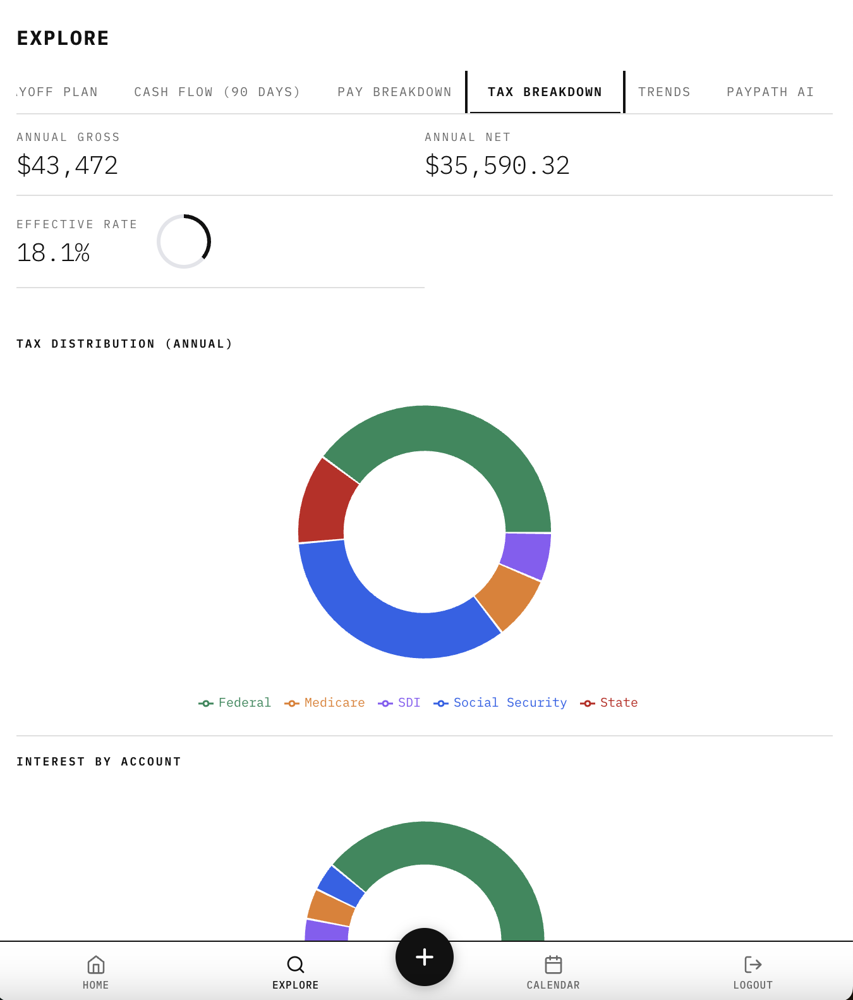
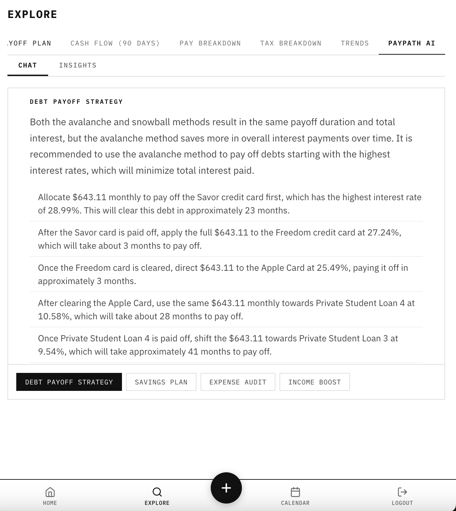

# PayPath Backend

Personal finance API built in Go. Tracks income, expenses, debts, and liquid assets.
Computes taxes, net worth, debt payoff timelines, and cash flow projections.
AI-powered financial insights via OpenAI. MongoDB for storage. JSON REST API consumed by a React frontend.

## Tech Stack

- **Language:** Go 1.26
- **Router:** `net/http` (stdlib ServeMux with method routing)
- **Database:** MongoDB — bundled Docker container or Atlas (`go.mongodb.org/mongo-driver/v2`)
- **AI:** OpenAI GPT-4o-mini (`github.com/sashabaranov/go-openai`)
- **Auth:** JWT (`golang-jwt/jwt/v5`) + bcrypt (`golang.org/x/crypto`)
- **Logging:** zerolog (`github.com/rs/zerolog`)

## Project Layout

Layered, feature-folder module: thin HTTP handlers call per-feature services, which depend on repository interfaces over MongoDB, with an in-memory TTL cache and singleflight read-collapsing.

```text
backend/
├── cmd/api/main.go        # entry point, signal handling
├── internal/
│   ├── config/            # env-based config
│   ├── server/            # HTTP server lifecycle
│   ├── api/
│   │   ├── router/        # route wiring
│   │   └── handler/       # thin HTTP handlers: auth, expenses, debts, income,
│   │                      #   liquid, finance, insights, strategies, bundle
│   ├── middleware/        # JWT auth, CORS, request logging
│   ├── services/          # per-feature business logic
│   │   ├── auth/  income/  expenses/  debts/
│   │   ├── reporting/     # taxes, payoff, scenarios, cashflow, calendar
│   │   ├── dashboard/  explore/  settings/   # per-page bundles
│   │   └── ai/            # insights/ + strategies/ (OpenAI-backed)
│   ├── liquid/            # liquid accounts feature
│   ├── storage/           # Mongo init, repositories, id gen, cache/ (TTL cache)
│   ├── clients/           # OpenAI client
│   └── seed/              # first-run demo data loader
├── pkg/                   # logger, response helpers, settings, utils
├── seed/                  # CSV seed data
└── tests/                 # integration tests
```

## API Endpoints

All prefixed with `/api`. JSON request/response bodies. All endpoints except auth require `Authorization: Bearer <token>`.

### Authentication (5)

| Method | Path             | Description      |
|--------|------------------|------------------|
| POST   | /auth/register   | Create account   |
| POST   | /auth/login      | Login, get JWT   |
| POST   | /auth/logout     | Revoke token     |
| GET    | /auth/me         | Current user     |
| DELETE | /auth/me         | Delete account   |

### Bundles (3)

| Method | Path              | Description                      |
|--------|-------------------|----------------------------------|
| GET    | /bundle/dashboard | All dashboard data in one call   |
| GET    | /bundle/explore   | All explore tab data in one call |
| GET    | /bundle/settings  | All settings data in one call    |

### Data Reads (9)

| Method | Path                    | Description                 |
|--------|-------------------------|-----------------------------|
| GET    | /summary                | Financial summary overview  |
| GET    | /expenses               | All expenses                |
| GET    | /debts                  | All debts                   |
| GET    | /income                 | All income/jobs             |
| GET    | /liquid                 | All liquid accounts         |
| GET    | /payoff                 | Debt payoff plan            |
| GET    | /scenarios              | Payoff scenarios            |
| GET    | /cashflow?days=90       | 90-day cash flow projection |
| GET    | /calendar?year=&month=  | Calendar events for a month |

Payoff, scenarios, cashflow, and calendar are computed by the reporting service — taxes (federal, state, Social Security, Medicare, SDI), debt payoff timelines, and projections that honor per-occurrence calendar exceptions (moved bills, one-time purchases, income amount overrides).



### AI Insights (5)

| Method | Path                    | Description                   |
|--------|-------------------------|-------------------------------|
| GET    | /ai/insights            | General AI financial insights |
| GET    | /ai/debt-payoff-strategy| AI debt payoff strategy       |
| GET    | /ai/savings-plan        | AI savings plan               |
| GET    | /ai/expense-audit       | AI expense audit              |
| GET    | /ai/income-boost        | AI income boost suggestions   |

These require `OPENAI_API_KEY` and power the PayPath AI tab in the frontend (screenshots in [`../img/personalizedFinAdvice/`](../img/personalizedFinAdvice/)):



### CRUD - Expenses (3)

| Method | Path           | Description    |
|--------|----------------|----------------|
| POST   | /expenses      | Create expense |
| PUT    | /expenses/{id} | Update expense |
| DELETE | /expenses/{id} | Delete expense |

### CRUD - Debts (3)

| Method | Path        | Description |
|--------|-------------|-------------|
| POST   | /debts      | Create debt |
| PUT    | /debts/{id} | Update debt |
| DELETE | /debts/{id} | Delete debt |

### CRUD - Income (3)

| Method | Path         | Description       |
|--------|--------------|-------------------|
| POST   | /income      | Create income/job |
| PUT    | /income/{id} | Update income/job |
| DELETE | /income/{id} | Delete income/job |

### CRUD - Liquid Accounts (2)

| Method | Path         | Description           |
|--------|--------------|-----------------------|
| POST   | /liquid      | Create liquid account |
| PUT    | /liquid/{id} | Update liquid account |

### Simulation (1)

| Method | Path                         | Description                        |
|--------|------------------------------|------------------------------------|
| GET    | /payoff?extra_payment={amt}  | Simulate payoff with extra payment |

## Environment

Read from the root `.env` or the shell:

| Variable | Purpose |
|----------|---------|
| `MONGODB_URI` | MongoDB connection string (Atlas or local) |
| `JWT_SECRET` | Signing key for auth tokens |
| `FRONTEND_URL` | Allowed CORS origin (e.g. `http://localhost:3000`) |
| `HTTP_ADDR` | Listen address (default `:8000`) |
| `ENV` | `development` / `production` |
| `OPENAI_API_KEY` | Enables the `/api/ai/*` endpoints (optional) |
| `STRIPE_*` | Stripe billing keys (optional) |

## Makefile

```text
make build     # compile binary
make run       # build and start server
make run-dev   # build and start with request logging
make test      # run all tests
make check     # fmt + vet + test
make tidy      # go mod tidy
make clean     # remove binary
make kill      # kill process on port 8000
make reset     # kill + clean
make reseed    # drop the database so it re-seeds on next start
```

## Docker

```bash
docker compose up --build backend   # API on :8000, works from anywhere in the repo
```

The API runs from the compose file at the repo root — the only one in the repo; compose finds it from any subdirectory by walking up. It loads the container's environment from the root `.env` (`cp .env.example .env` there first — compose errors if it's missing), forwarding every variable including the optional `STRIPE_*` keys. Leave `MONGODB_URI` blank and a bundled Mongo container starts alongside the API; set it (e.g. an Atlas URI) and the bundled Mongo is skipped. For a Mongo running on the host use `host.docker.internal` — `localhost` inside a container is the container itself.

`.env.example` in this directory lists the variables to set in your platform's dashboard when deploying the backend on its own.

To build just the image: `docker build -t paypath-backend .` — multi-stage build producing a static binary plus the `seed/` CSVs (read on first boot). The container listens on :8000 and honors `PORT`.

## Seed Data

On first run (empty users collection), seeds a default user `user@email.com` / `userpassword` and loads CSV data from `seed/` with cached AI insights.
