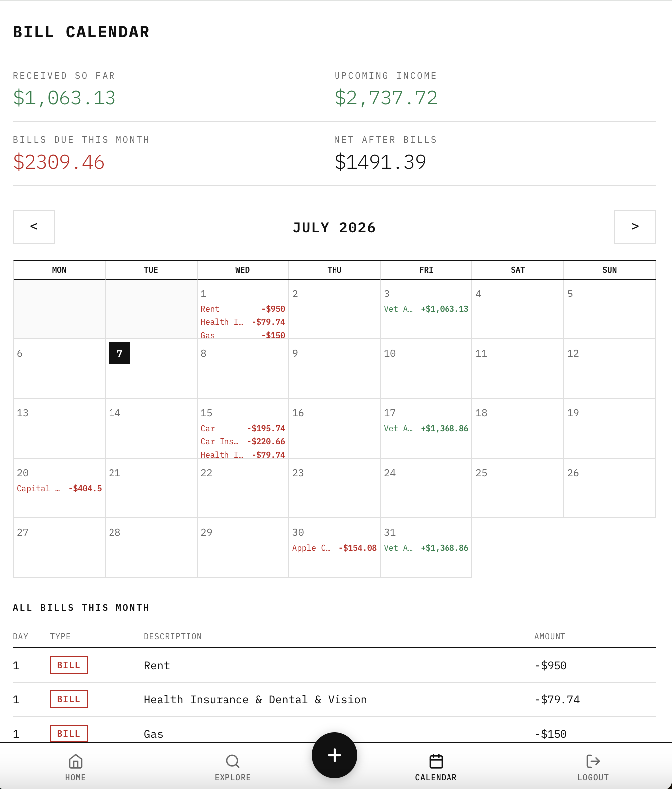
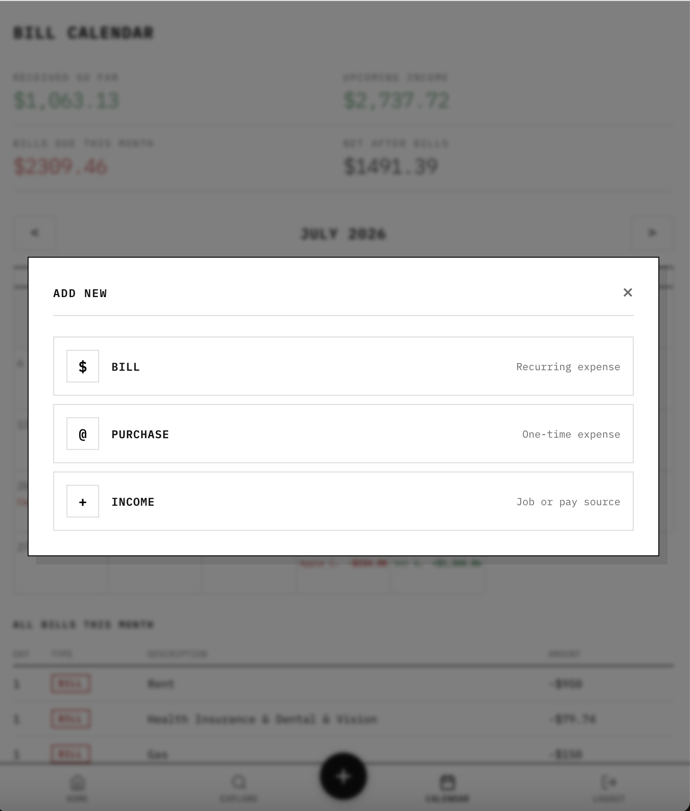
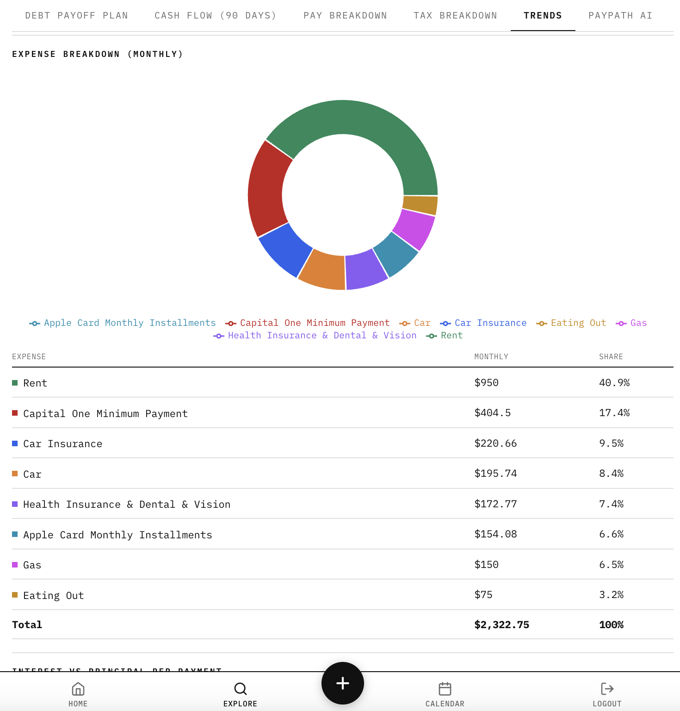
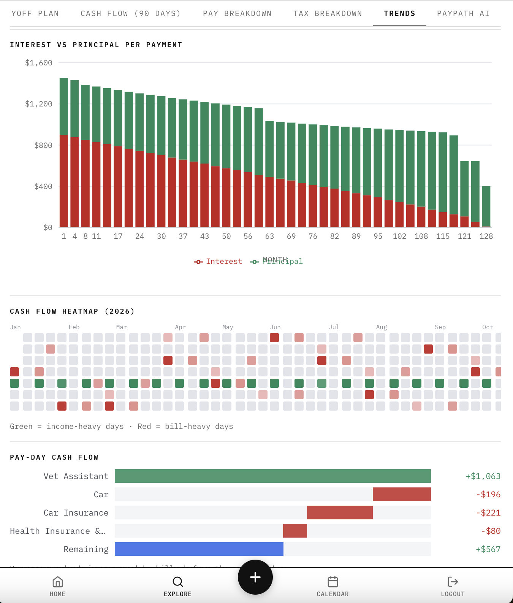
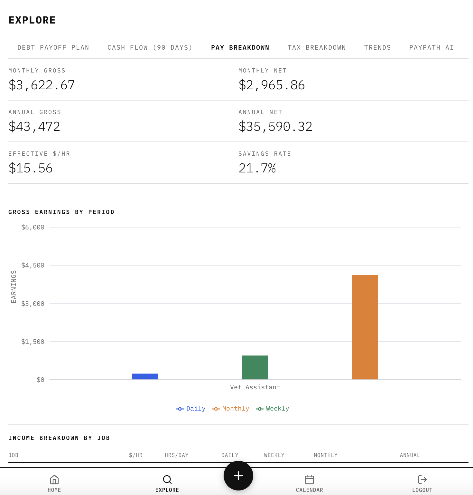
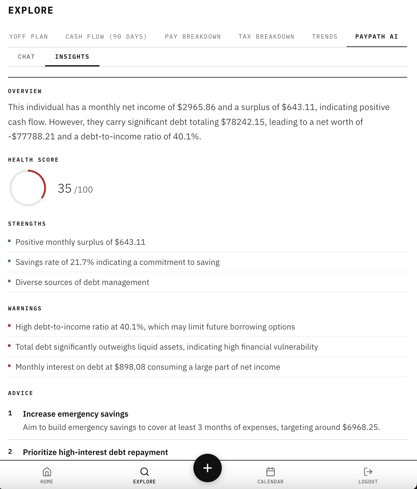
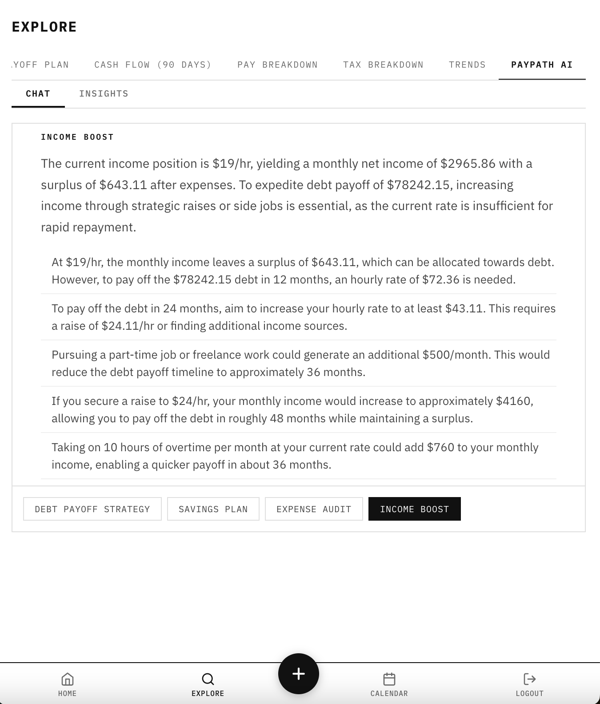

# PayPath Frontend

Next.js app for PayPath, a personal finance dashboard. Talks to the Go API in `../backend`.

## Stack

- Next.js 16 (App Router) + React 19
- CSS Modules
- Recharts for charts
- JWT auth against the backend, token handled in `lib/auth.js`
- Fonts self-hosted via `next/font` (no external Google Fonts request)

## Getting started

Next.js 16 requires Node ≥ 20.9 (`.nvmrc` at the repo root pins 20; the Makefile runs `nvm use 24`, and the Docker image uses Node 24).

1. Copy the env file and point it at the API:

   ```
   cp .env.example .env.local
   # NEXT_PUBLIC_API_URL=http://localhost:8000/api
   ```

2. Start the backend first (`make run` in `../backend`, serves on :8000).

3. Install and run:

   ```
   npm install
   make dev        # cleans .next, starts next dev, opens Chrome at localhost:3000
   ```

   Or without the Makefile: `npm run dev`.

## Make targets

| Target | What it does |
|--------|--------------|
| `make dev` / `make run` | Clean `.next`, run the dev server, open Chrome |
| `make build` | Clean production build |
| `make start` | Build, then serve the production build |
| `make clean` | Remove `.next` |

## Docker

```bash
docker compose up --build frontend   # production build on :3000, works from anywhere in the repo
```

The container is defined in the compose file at the repo root — the only one in the repo; compose finds it from any subdirectory by walking up. Starting `frontend` also starts the API it depends on.

`NEXT_PUBLIC_API_URL` is baked into the client bundle at **build** time, so in Docker it's a build arg, not a runtime env var — changing it means rebuilding the image:

```bash
NEXT_PUBLIC_API_URL=https://api.example.com/api docker compose up --build frontend
# or building directly:
docker build --build-arg NEXT_PUBLIC_API_URL=https://api.example.com/api -t paypath-frontend .
```

It defaults to `http://localhost:8000/api`. The browser makes these calls, so the URL must be reachable from wherever the page is viewed (the host), not from inside the Docker network — service names like `http://backend:8000` won't work.

The image ships Next's standalone server, which requires `output: "standalone"` in `next.config.js` — if that setting is removed, the Dockerfile's `COPY .next/standalone` step fails.

## Layout

```
app/            routes (App Router)
  page.jsx        dashboard (home)
  explore/        tabs: debt payoff plan, cash flow (90 days), pay breakdown,
                  tax breakdown, trends, PayPath AI
  calendar/       bill & income calendar with per-occurrence edits
  settings/       income / expenses / debts / accounts / account tabs
  login/  setup/  auth + first-run flow
components/     shared UI (AppShell, Sidebar, DataTable, Modal, charts, ...)
  dashboard/  explore/  settings/   per-page sections
lib/
  api.js        fetch wrapper: auth header, 401 -> /login, caching
  auth.js       token storage
  cache.js      client-side response cache
  constants.js  shared constants
  simulate.js   client-side finance simulations
```

`@/*` resolves to the frontend root (see `jsconfig.json`).

## Screenshots

The calendar shows paydays and bills on a month grid with running totals; single occurrences can be edited (move a bill, log a one-time purchase, or override one paycheck's amount), and the floating **+** quick-adds a bill, purchase, or income source from any page.



<br>



Explore's Trends tab (`components/explore/TrendsTab.jsx`) charts the monthly expense breakdown, interest vs principal per payment, a cash-flow heatmap (`CalendarHeatmap.jsx`), and a pay-day waterfall (`PaydayWaterfall.jsx`); Pay and Tax Breakdown tabs cover gross vs net, effective $/hr, savings rate, and tax distribution.



<br>



<br>



The PayPath AI tab (`AIInsightsTab.jsx`) renders the backend's `/api/ai/*` responses: insights with a health score, plus debt payoff strategy, savings plan, expense audit, and income boost reports.



<br>

